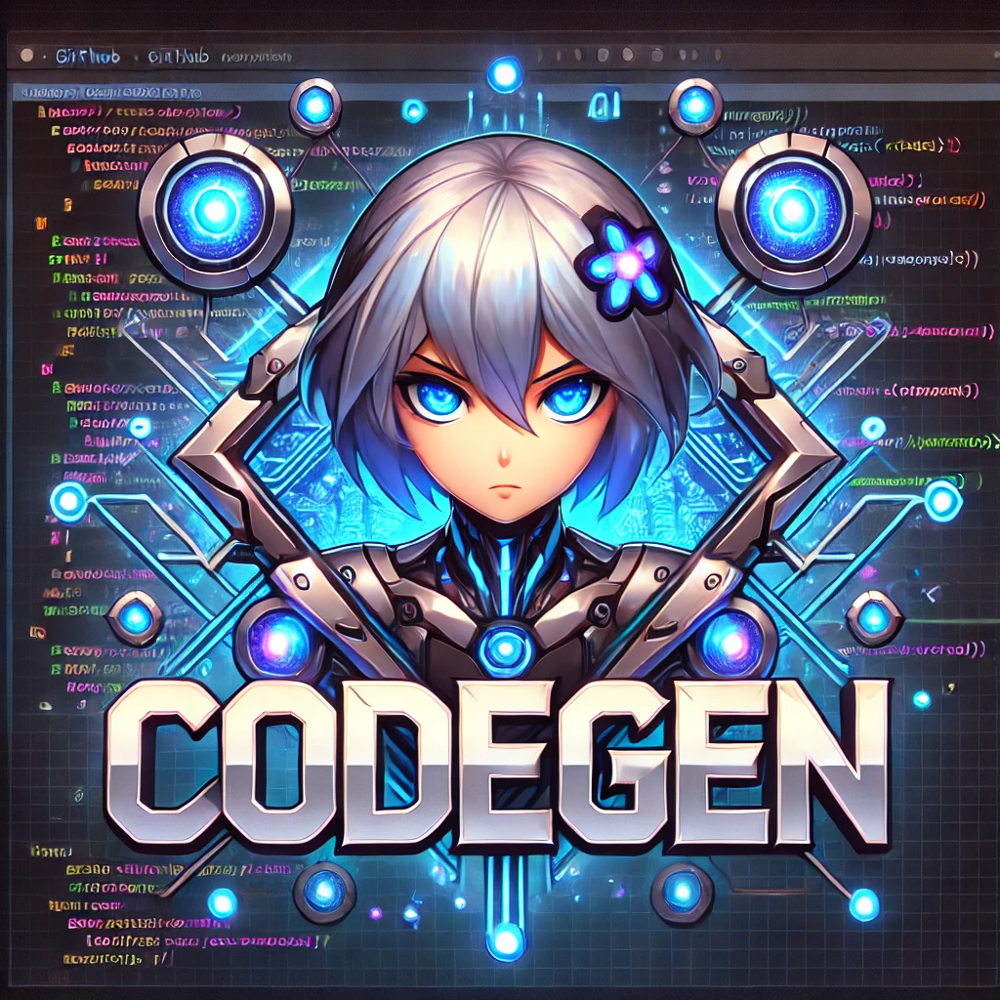

# CodeGen


A Streamlit-based web application that generates, validates, and helps solve coding challenges using AI. The application supports multiple users and integrates with OpenAI's GPT models for intelligent question generation and solution validation.

## 🌟 Features

- **AI-Powered Question Generation**: Creates unique coding challenges using GPT models
- **Interactive Solution Interface**: Write and test solutions in real-time
- **Automated Testing**: Validates solutions against test cases
- **Code Formatting**: Automatically formats submitted code
- **Progress Tracking**: Monitors user progress through challenges
- **MongoDB Integration**: Persistent storage of questions and user progress
- **Multi-user Support**: Handles concurrent users efficiently

## 🛠 Tech Stack

- Python 3.13
- Streamlit
- OpenAI LLMs
- MongoDB (optional)
- Docker & Docker Compose
- Nginx
- AWS EC2

## 📋 Prerequisites

- Python 3.13+
- Docker and Docker Compose
- OpenAI API key
- Tavily API key
- MongoDB URI (optional)

## 🚀 Quick Start (Local Development)

1. **Clone the Repository**
   ```bash
   git clone https://github.com/yourusername/codegen.git
   cd codegen
   ```

2. **Set Up Environment**
   ```bash
   # Create and activate virtual environment
   python -m venv venv
   source venv/bin/activate  # On Windows: venv\Scripts\activate
   
   # Install dependencies
   pip install -r requirements.txt
   ```

3. **Configure Environment Variables**
   Create a `.streamlit/secrets.toml` file:
   ```toml
   OPENAI_API_KEY = "your-openai-key"
   TAVILY_API_KEY = "your-tavily-key"
   MONGODB_URI = "your-mongodb-uri"  # Optional
   ```

4. **Run Locally**
   ```bash
   streamlit run CodeGen.py
   ```

## 🌍 Production Deployment

### AWS EC2 Deployment
For detailed deployment instructions, including EC2 setup, security configurations, and monitoring, see our [Deployment Guide](DEPLOYMENT.md).

Quick deployment steps:

1. **Launch EC2 Instance**
   - Recommended: t3.medium or larger
   - Ubuntu 22.04 LTS or Amazon Linux 2023
   - Configure security groups for ports 22, 80, and 443

2. **Run Setup Script**
   ```bash
   # For Ubuntu
   ./scripts/setup_ec2.sh

   # For Amazon Linux
   ./scripts/setup_amazon_linux.sh
   ```

3. **Configure Environment**
   ```bash
   cd ~/codegen/secrets
   # Edit .env with your API keys
   sudo nano .env
   ```

4. **Start Application**
   ```bash
   cd ~/codegen
   docker-compose up -d
   ```

## 🌍 Local Docker Deployment

1. **Build and Run with Docker Compose**
   ```bash
   docker-compose up --build -d
   ```

2. **Access the Application**
   ```
   http://localhost:8501
   ```

## 🌍 Project Structure
See [PROJECT_STRUCTURE](project_structure) for detailed information about the project organization.

## 📊 Database Setup

### Local MongoDB Setup (Optional)
1. Install MongoDB Community Edition
2. Create database and user:
   ```bash
   mongosh
   use codegen
   db.createUser({
     user: "codegen_user",
     pwd: "your_password",
     roles: ["readWrite"]
   })
   ```

### Migration
To migrate existing JSON data to MongoDB:
```bash
python scripts/migrate_to_mongodb.py
```

## 🔒 Security Notes
- Never commit sensitive credentials to version control
- Use secure environment variables for API keys
- Follow AWS security best practices for production deployments
- Regularly update dependencies and system packages
- Monitor application logs and performance
